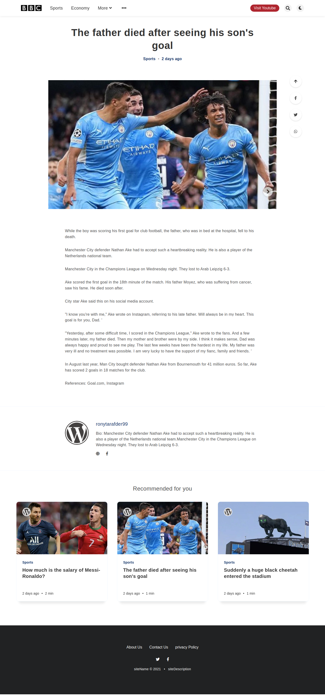

# Contact Me: [FaceBook](https://www.facebook.com/ronytarafder99/)


**[Live Demo - 1](http://advance-djblog.herokuapp.com)**

**[Live Demo - 2](http://advance-djblog.herokuapp.com)**

# Features:
- An Admin Can Get All The Access Of This News Site.
- Admin Can Add Group Users.
- There Are Many Section Contains In This Site.
- View will be counted.
- Latest news will be shown in first.
- There is a category.
- If there is a news for particular cat or subcat then the cat will be shown.
- I used forloop to view news in different section.
etc...........

# Tools
## Front end part
* HTML
* CSS
* JS
## Backend
* Django
* SQLite 3

## I Used Here My Own Customized Admin Panel.
```
This Website is fully Dynamic.
You can change every part through Admin Panel,
Master user can controle everything.
```

# Screenshots of the Project:
<p align="center">
  
  
  
  
  
  
  
</p>